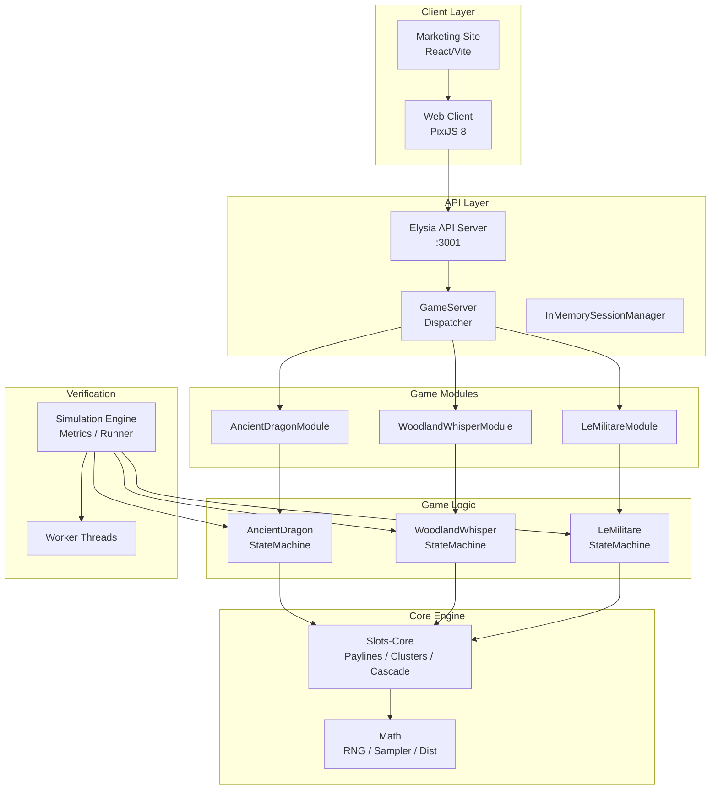
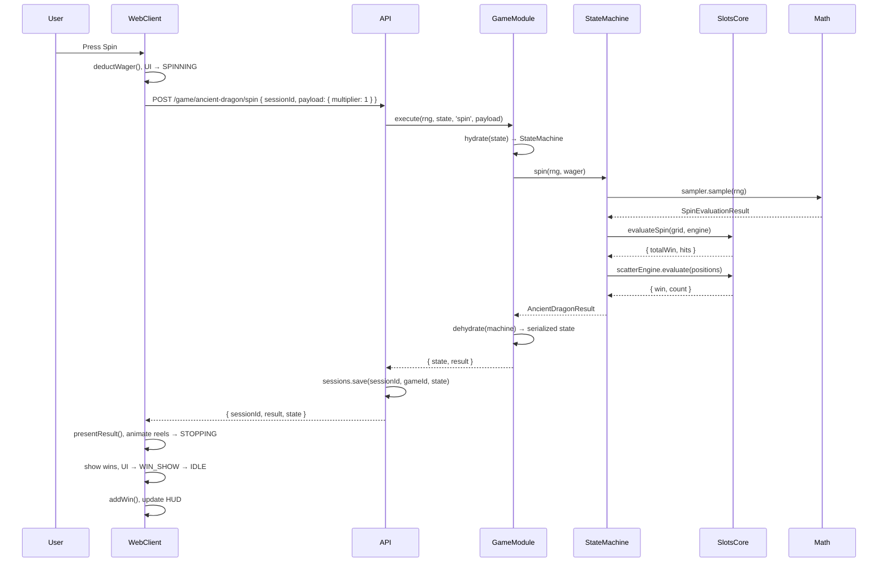
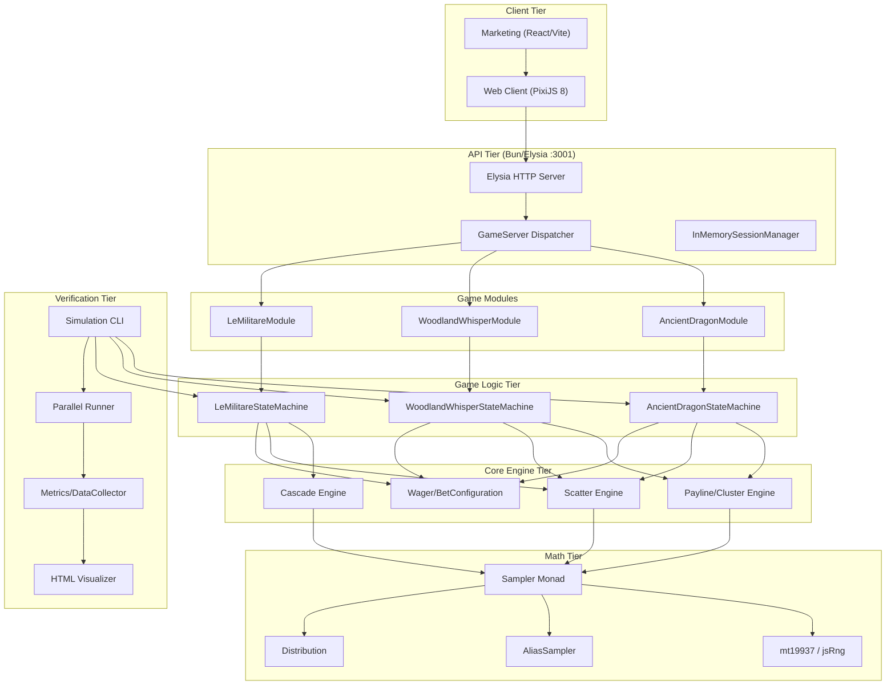

# TGSlots — Complete Codebase Knowledge Document

> Generated 2026-05-25; rendering, grid and payline descriptions updated 2026-10-07. Current authoring configs and in-game rules are authoritative for payout and feature parameters.

---

## Table of Contents

1. [High-Level Overview](#1-high-level-overview)
2. [System Architecture](#2-system-architecture)
3. [Package-by-Package Deep Dive](#3-package-by-package-deep-dive)
4. [Feature Catalog](#4-feature-catalog)
5. [Data Flow & Request Lifecycle](#5-data-flow--request-lifecycle)
6. [Things You Must Know Before Changing Code](#6-things-you-must-know-before-changing-code)
7. [Technical Reference & Glossary](#7-technical-reference--glossary)

---

## 1. High-Level Overview

### 1.1 What Is TGSlots?

TGSlots is a **multi-game online slot machine platform** built as a **Bun-based TypeScript monorepo**. It provides:

- **Server-side slot math** (RNG, sampling, payline/cluster evaluation)
- **A stateless HTTP API** (Elysia/Bun) for game actions
- **A PixiJS web client** for playing games in a browser
- **A marketing site** (React/Vite) for game discovery and presentation
- **A Monte Carlo simulation engine** for verifying game math (RTP, volatility, feature frequency)

### 1.2 Target Users

- **End users**: Play slot games in a web browser
- **Game designers/mathematicians**: Run simulations to verify RTP and feature balance
- **Game developers**: Add new slot games using the shared framework

### 1.3 Business Purpose

Each game is a discrete casino-style slot machine with a configurable paytable, reel strips, and bonus features. The platform separates **math verification** (simulations) from **live play** (API + web client) so that game math can be proven correct at billions of spins before any player touches it.

### 1.4 Tech Stack

| Layer | Technology |
|-------|-----------|
| Runtime | Bun (1.3.13) |
| Language | TypeScript (strict mode, ESM) |
| API framework | Elysia (Bun-native) |
| Frontend engine | PixiJS 8 (WebGL/Canvas) |
| Frontend UI | Custom HTML/CSS (web components style) |
| Marketing site | React 18 + Vite |
| Testing | `bun:test` (Jest-compatible) |
| Linting | ESLint 10 flat config + Prettier |
| Git hooks | Husky + lint-staged |
| Monorepo | Bun workspaces |

### 1.5 Game Lineup

| Game | Package | Type | Key Features |
|------|---------|------|-------------|
| Ancient Dragon | `@tgslots/ancient-dragon` | Payline (5x3, 25 lines) | Free spins, mystery (INNER) symbols, yin-yang scatters |
| Woodland Whisper | `@tgslots/woodland-whisper` | Payline (5x3, 30 lines) | Free spins, pick bonus, buy bonus |
| Le Militare | `@tgslots/le-militare` | Cluster pays (6x5) | Combat cascade, sticky wilds, air raid, S300 activation, 3 volatility modes, buy bonus |

### 1.6 Directory Map

```
tgslots/
├── apps/
│   ├── api/              # Elysia HTTP server — game action dispatch
│   ├── web-client/       # PixiJS browser client — game rendering & UI
│   ├── marketing/        # React site — lobby, game pages, launch
│   └── simulations/      # CLI + worker threads — Monte Carlo runs
├── packages/
│   ├── math/             # RNG, Sampler<T> monad, distributions, either monad
│   ├── slots-core/       # Payline eval, cluster eval, cascade, scatter, betting
│   ├── slots-simulation-engine/  # StateMachine interface, metrics, runner, test harness
│   ├── shared-contracts/ # Type registries, serialized states, game manifests
│   ├── asset-pipeline/   # (WIP) asset processing
│   └── games/
│       ├── ancient-dragon/
│       ├── woodland-whisper/
│       └── le-militare/
├── memory/               # Obsidian vault — ADRs, active context, component docs
├── scripts/              # CLI helpers
├── CLAUDE.md             # Project instructions for AI assistants
└── package.json          # Root workspace config
```

---

## 2. System Architecture

### 2.1 Architecture Diagram



### 2.2 Core Architectural Patterns

#### 2.2.1 State Machine Pattern (Game Logic)

Every game implements the `StateMachine<TResult, TState>` interface defined in `packages/slots-simulation-engine/src/core/state-machine.ts:794-808`:

```typescript
interface StateMachine<TResult extends SpinResult, TState = object> {
  readonly state: TState
  spin(rng: Rng, wager: Wager): TResult      // Initial spin
  next(rng: Rng): TResult | null              // Subsequent spins (free spins, cascades)
  recordResultMetrics?(...): void              // Per-result telemetry
  recordRoundMetrics?(...): void               // Per-round telemetry
}
```

The `spin()` / `next()` contract is critical:
- `spin()` starts a new round, resets any pending state, and returns the first result
- `next()` is called in a loop until it returns `null`, signaling the round is complete
- This single pattern handles base game spins, free spin sequences, cascades, and bonus features

#### 2.2.2 RNG Discipline (CRITICAL)

All randomness flows through `Sampler<T>` monads. Game logic functions NEVER accept `rng: Rng` as a parameter. The ONLY sites that consume `rng` directly are:
1. `StateMachine.spin(rng)` — simulation engine boundary
2. `StateMachine.next(rng)` — simulation engine boundary

Inside these methods, only `.sample(rng)` is called on pre-built `Sampler<T>` constants. This is enforced by project conventions (see `CLAUDE.md` "RNG Discipline" section).

#### 2.2.3 Module Pattern (API Game Modules)

Each game has an `IGameModule<G>` implementation that bridges the HTTP API to the game state machine:

```typescript
interface IGameModule<G extends GameId> {
  readonly gameId: G
  defaultState(rng: Rng): GameState<G>
  validateAction(state, action, payload): string | null
  execute(rng, state, action, payload): { state: GameState<G>; result?: GameResult<G> }
}
```

The module is responsible for:
- **Hydration**: Deserializing JSON state into a live `StateMachine` instance
- **Dehydration**: Serializing the machine's state back to JSON-safe form
- **Validation**: Checking that the requested action is legal given current state
- **Execution**: Running the action through the state machine

#### 2.2.4 Client Game Runtime Pattern

Each game in the web-client exports an `IGameClient<G>` with:
- `manifest`: metadata (symbols, grid size, theme colors, features)
- `assets`: asset URLs (raster images, atlas frame metadata, audio)
- `mount(ctx)`: creates a `GameRuntime` that handles `applyState()`, `presentResult()`, `resize()`, `destroy()`

Game-specific logic (animations, combat effects, pick bonus UI) lives in the game's `runtime.ts` and helper files.

### 2.3 Cross-Cutting Concerns

#### Session Management

- **API side**: `InMemorySessionManager` stores `{ gameId, state }` keyed by UUID. Sessions are created on first action without a sessionId, and reused when sessionId is provided. No persistence — server restart loses all sessions.
- **Client side**: `SessionManager` manages balance, bet multiplier, last win/wager. Session ID is stored in `localStorage` under `tgslots:session:<gameId>`.

#### Security

- No authentication implemented (in-development platform)
- Input validation at API boundaries via Elysia schema validation + `validateAction()` in game modules
- Bet multiplier validated as positive integer before reaching game logic
- Sessions validated for game ID match (prevent cross-game session reuse)

#### Error Handling

- API uses `DispatchOutcome` discriminated union: `{ ok: true, response } | { ok: false, status, error }`
- State machines throw on invalid state (e.g., `freeGameSpin()` when no free spins remain)
- Client `ApiError` class carries HTTP status code
- `Either<L, R>` monad from `@tgslots/math` available for recoverable errors in library code (not heavily used yet)

#### Metrics

The `ModernDataCollector` (in `state-machine.ts`) provides a hierarchical metric system with five metric kinds:

| Kind | Purpose | Finalized Output |
|------|---------|-----------------|
| `count` | Event frequency | total, rate (per round), cycle (rounds per event) |
| `value` | Observed values | count, sum, average, min, max |
| `distribution` | Categorical breakdown | buckets with count and ratio |
| `payout` | Aggregate payouts | count, total, average, min, max |
| `rtp` | Wager-normalized return | count, total, ratio (= total / totalBet) |

Metrics are organized in scoped paths (e.g., `base-game/win`, `features/free-spins/spins-played`).

---

## 3. Package-by-Package Deep Dive

### 3.1 `@tgslots/math` (`packages/math/`)

**Purpose**: Foundational math primitives for randomness, probability, and functional programming.

**Key exports**:

| File | Key Types/Functions | Purpose |
|------|-------------------|---------|
| `src/rng/types.ts` | `Rng = (lo, hi) => number` | RNG function type — returns uniform int in [lo, hi) |
| `src/rng/mt19937.ts` | `mt19937(seed)` → `Rng` | Mersenne Twister 19937, seedable, period 2^19937-1. Uses rejection sampling to eliminate modulo bias. |
| `src/rng/mt19937.ts` | `jsRng()` → `Rng` | Math.random() wrapper, non-seedable |
| `src/samplers/alias-sampler.ts` | `AliasSampler<T>` | Walker-Vose alias method, O(1) sampling. Fixed-point precision P=2^20. Max 4096 items. |
| `src/samplers/linear-sampler.ts` | `LinearSampler<T>` | O(n) weighted selection for n < 32 |
| `src/probability/sampling-plan.ts` | `SamplingPlan<T>` | Free Monad AST for probabilistic computations. Nodes: Pure, Draw, FlatMap. Stack-safe trampoline interpreter. |
| `src/probability/distribution.ts` | `Sampler<T>` | High-performance wrapper over `SamplingPlan`. Has fast-path `_sampler` closure for O(1) sampling. |
| `src/probability/distribution.ts` | `Distribution<T>` | Enumerable discrete probability distribution. Supports `enumerate()`, `expectedValue()`, computation expressions. |
| `src/probability/distribution.ts` | `TrackedDistribution<T, Path>` | Distribution with path tracking — used for debugging probability trees. |
| `src/functional/either.ts` | `Either<L, R>` | Left/Right monad for error handling |
| `src/functional/array1.ts` | `Array1<T>` | Non-empty array type |

**Design Notes**:
- `Sampler<T>` has a dual-path architecture: stores both the AST (`plan`) and a direct sampling closure (`_sampler`). The closure bypasses the trampoline interpreter for O(1) hot-path sampling.
- `createWeightedSampler()` auto-selects `LinearSampler` for n <= 32 (better cache locality) or `AliasSampler` for n > 32.
- Alias sampler uses interleaved `[prob, alias]` pairs in a single `Uint32Array` so both values share a cache line.

### 3.2 `@tgslots/slots-core` (`packages/slots-core/`)

**Purpose**: Slot-specific evaluation engines — paylines, clusters, cascades, scatters, betting.

**Module map**:

| Module | Key exports | Purpose |
|--------|-----------|---------|
| `src/paylines/slot-engine.ts` | `createSlotEngine()`, `SlotWithPaylinesEngine` | Builds engine from config: symbol registry, flat paytable, payline trie |
| `src/paylines/evaluator.ts` | `evaluateSpin()` | Hot-path payline evaluation — returns `{ totalWin, hits }` |
| `src/paylines/payline-trie.ts` | `buildPaylineTrie()`, `PaylineTrie` | Precomputed trie for O(reels) payline lookup |
| `src/paytable/flat-paytable.ts` | `buildFlatPaytable()` | Converts config paytable to pre-sized array indexed by [symbolId][count] |
| `src/paytable/cluster-paytable.ts` | `buildClusterPaytable()` | Same but sized to gridArea+1 for cluster sizes |
| `src/cluster/cluster-engine.ts` | `createClusterSlotEngine()`, `ClusterSlotEngine` | Cluster engine with BFS-based cluster detection |
| `src/cluster/evaluator.ts` | `evaluateClusters()` | Hot-path cluster evaluation |
| `src/cascade/cascade-engine.ts` | Cascade logic | Symbol vanishing, gravity, refill |
| `src/cascade/cascade-grid.ts` | `MutableCascadeGrid` | Mutable grid for cascade operations |
| `src/scatter/precomputed-engine.ts` | `PrecomputedScatterEngine` | Precomputed scatter evaluation with wrapping strips |
| `src/spin-grid/spin-grid.ts` | `ProjectedGrid` | Read-only view of reel strips at specific positions |
| `src/betting/wager.ts` | `Wager` | Immutable wager breakdown: creditsPerLine, totalLineWager, totalSideBet, totalWager |
| `src/betting/config.ts` | `BetConfiguration` | Game cost structure — all values are strict integers (credits) |
| `src/symbol-registry.ts` | `createSymbolRegistry()` | Maps symbol names → integer IDs, identifies wild |

**Critical design details**:
- All evaluation is done with integer symbol IDs — never string comparisons on the hot path
- Payline trie precomputes all lookup paths so evaluation is O(reels) not O(paylines × reels)
- Reel strips include wrapping (+2 extra positions at end) for scatter evaluation that spans reel boundaries
- `Wager` enforces integrity at construction: `totalLineWager + totalSideBet === totalWager`

### 3.3 `@tgslots/slots-simulation-engine` (`packages/slots-simulation-engine/`)

**Purpose**: Simulation framework — StateMachine interface, metrics collection, parallel runner, test harness, HTML report visualizer.

**Key components**:

| File | Purpose |
|------|---------|
| `src/core/state-machine.ts` | `StateMachine` interface, `SpinResult`, `ModernDataCollector`, `Metrics` (merge/finalize), `runCycle()` |
| `src/runner/index.ts` | `runSimulation()` — parallel worker-based runner with progress snapshots |
| `src/testing/slots-test-engine.ts` | `SlotsTestEngine` / `SlotsTestSession` — builder-pattern test harness |
| `src/cli/index.ts` | CLI argument parsing, simulation orchestration |
| `src/cli/comparison.ts` | A/B comparison of simulation runs |
| `src/cli/formatter.ts` | Text-based result formatting |
| `src/visualizer/` | HTML report generation — sections for KPIs, RTP donuts, distributions, scope trees |

**`runCycle()`** is the core simulation loop:

```typescript
function runCycle(sm, rng, collector, wager) {
  collector.beginRound(wager.totalWager)
  const initial = sm.spin(rng, wager)          // 1. Base spin
  collector.collect(initial)
  sm.recordResultMetrics?.(collector, initial, { phase: 'spin', wager })

  let nextResult
  while ((nextResult = sm.next(rng)) !== null) {  // 2. Auto-advance
    collector.collect(nextResult)
    sm.recordResultMetrics?.(collector, nextResult, { phase: 'next', wager })
  }

  collector.endRound()                            // 3. Finalize + record round metrics
  sm.recordRoundMetrics?.(collector, round, wager)
}
```

**`SlotsTestEngine`** is the mandatory test harness for all game tests. Key features:
- Builder pattern: `createSlotsTestEngine(MachineClass, betConfig).registerAction(...).build()`
- Sessions provide `act()`, `scenario()`, `probe()` with full type inference
- `withinRound()` for grouping multiple spin/next calls into one round
- `findSeed()` for discovering seeds that produce specific conditions

### 3.4 `@tgslots/shared-contracts` (`packages/shared-contracts/`)

**Purpose**: Types shared between API and web-client — game registry, serialized states, game manifests.

**Key types**:

```typescript
// Game registry — extended via declaration merging by each game
interface GameRegistry {}
type GameId = keyof GameRegistry & string
type GameState<G> = GameRegistry[G]['state']
type GameResult<G> = GameRegistry[G]['result']

// Action dispatch
interface ActionRequest<G, A> { gameId, action, sessionId?, payload }
interface ActionResponse<G> { sessionId, result?, state }

// Client manifest
interface GameManifest {
  gameId, displayName, grid: { reels, rows }
  symbols: SymbolMeta[]      // { id, name, kind: 'regular'|'wild'|'scatter'|'bonus' }
  theme: ThemePalette         // { primary, accent, background, text }
  winTiers: WinTier[]         // { thresholdX, copy, textureName }
  features: FeatureTag[]      // 'free-spins'|'pick-bonus'|'buy-bonus'|'cluster-pays'|...
}

// Serialized states (JSON-safe, no class instances)
interface AncientDragonSerializedState { freeSpins: ADFreeSpinSerialized | null }
interface WoodlandWhisperSerializedState { lastGrid, freeSpins, pickBonus }
interface LeMilitareSerializedState { lastGrid, freeSpins }
```

### 3.5 Game Packages

#### 3.5.1 Ancient Dragon (`packages/games/ancient-dragon/`)

**Type**: 5-reel, 3-row, 25-line payline slot
**Features**: Free spins (3+ scatters trigger 10 FS, retriggerable), mystery INNER symbol, wild (GOLDDRAGON)

**File structure**:
- `src/constants.ts` — Symbol IDs, paytable, scatter pay, payline data, reel strips, INNER weights (all from `config/config.json`)
- `src/engine.ts` — Builds `SlotWithPaylinesEngine` once at import time
- `src/logic.ts` — `ANCIENT_DRAGON_SAMPLER(wager)` — the spin sampler using inner symbol resolution and scatter evaluation
- `src/game-state-machine.ts` — `AncientDragonStateMachine` implementing `StateMachine<AncientDragonResult, AncientDragonState>`

**Spin flow**:
1. Sample INNER replacement symbol from weighted distribution
2. Build reel strips with INNER positions replaced
3. Sample random positions for each reel
4. Evaluate paylines (line wins) + scatters (yin-yang count)
5. 3+ scatters → trigger free spins (state transition)

**INNER mechanism**: The INNER symbol on the reel strip is a placeholder. On each spin, it's replaced with a specific regular symbol chosen by weighted random selection (weights from occurrence counts in `inner_reel_strip`).

#### 3.5.2 Woodland Whisper (`packages/games/woodland-whisper/`)

**Type**: 5-reel, 3-row, 30-line payline slot
**Features**: Free spins, pick bonus (pick-until-repeat), buy bonus

**File structure**:
- `src/constants.ts` — Symbols, paytable, scatter pay, reel strips, pick bonus table, buy bonus cost
- `src/engine.ts` — Payline engine
- `src/logic.ts` — Spin sampler (similar to Ancient Dragon but without INNER)
- `src/game-state-machine.ts` — `WoodlandWhisperStateMachine` with base/free/pick/buy states
- `src/pick-bonus.ts` — Pick bonus generation: creates board, pick sequence using Fisher-Yates shuffle

**Pick bonus mechanic**: Player picks from a board of value pairs until a value repeats. The repeat value is the win. Uses `Sampler<T>` monad for all randomness — board shuffling, value placement, pick sequence.

#### 3.5.3 Le Militare (`packages/games/le-militare/`)

**Type**: 6-reel, 6-row cluster pays slot
**Features**: Combat cascade, S300 activation (turns reels wild), Air Raid (base game multiplier wilds), sticky wilds, 3 volatility modes (Recon/Assault/Siege), buy bonus, free spins with persistent armed reels

**File structure**:
- `src/constants.ts` — Symbols (S300, PLANE, WILD, SCATTER, regulars), mode configs (multiplier weights, air raid params), buy options
- `src/types.ts` — `LeMilitareSpinResult`, `CombatCascadeStep`, `ShootdownEvent`, `ActivationEvent`, `AirRaidPlacement`
- `src/engine.ts` — Cluster engine
- `src/grid-samplers.ts` — Reel strip chunk samplers for cascade refills
- `src/logic.ts` — Spin sampler: initial grid → base evaluation → air raid → cascade loop
- `src/combat.ts` — Combat operation: S300 detection, plane shootdown, wild placement, gravity refill, cascade loop
- `src/game-state-machine.ts` — `LeMilitareStateMachine` with base/free/buy result types
- `src/helpers.ts` — Grid snapshot utilities

**Combat cascade flow**:
1. Initial grid sampled from reel strips
2. Evaluate clusters (remove winning clusters)
3. Run Air Raid (if triggered): planes fly over, S300 intercepts some (drops multiplier-WILDs), misses fly off
4. S300 activation: newly landed S300 symbols arm their reels, converting all cells to WILD
5. Cascade: vanish winners → gravity → refill → re-evaluate (loop, max cascade steps)
6. Sticky wilds from shootdowns survive vanishing

**Three volatility modes**: Recon (low), Assault (medium), Siege (high). Each has different multiplier weight tables and Air Raid trigger/squadron/hit probabilities.

### 3.6 Applications

#### 3.6.1 API Server (`apps/api/`)

- **Framework**: Elysia (Bun-native HTTP framework)
- **Port**: 3001 (configurable via `PORT` env)
- **Middleware**: CORS, Swagger documentation
- **Routes**:
  - `POST /game/:gameId/:action` — Generic dispatch (spin, freespin, state, buy)
  - Game-specific routes for type-safe action dispatch
- **Architecture**: `GameServer` dispatcher → `IGameModule` per game → hydrate → execute → dehydrate → save session
- **RNG**: Uses `jsRng()` (Math.random-based) — not seedable, suitable for live play

#### 3.6.2 Web Client (`apps/web-client/`)

- **Engine**: PixiJS 8 for WebGL/Canvas rendering
- **Architecture**: Engine layer + per-game runtimes

**Engine components** (`src/engine/`):
| Component | Purpose |
|-----------|---------|
| `game-client.ts` | `IGameClient<G>` and `GameRuntime<G>` interfaces |
| `dispatcher.ts` | `GameDispatcher<G>` — HTTP client for game API |
| `state-machine.ts` | UI state machine: IDLE → SPINNING → STOPPING → WIN_SHOW → FEATURE_TRANSITION |
| `session-manager.ts` | Client-side balance, bet multiplier |
| `scene.ts` | PixiJS scene setup |
| `reel.ts` / `reel-set.ts` | Reel rendering with symbol animation |
| `spin-orchestrator.ts` | Coordinates spin animation, API call, result presentation |
| `event-bus.ts` | Game event pub/sub |
| `hud.ts` | Heads-up display (balance, bet, win) |
| `layout.ts` | Responsive layout calculations |
| `win-overlay.ts` | Win celebration overlays |
| `sound-manager.ts` | Audio playback |

**Game runtimes** (`src/games/<game>/`):
Each game provides:
- `manifest.ts` — `GameManifest`
- `assets.ts` — `AssetManifest`
- `runtime.ts` — `GameRuntime` implementation with game-specific animations
- `index.ts` — `IGameClient` export

Le Militare has the most complex runtime with combat animations (`combat/`), mascot rendering (`mascot/`), buy feature modal, multiplier HUD, and extensive helpers.

#### 3.6.3 Marketing Site (`apps/marketing/`)

- **Framework**: React 18 + Vite + Tailwind CSS
- **Pages/Components**: `Lobby` (game selection), `GamePresentationPage` (game details with hero, lore, features, stats), `GameLauncher` (opens web-client)
- **Game data**: Each game has a descriptor in `src/games/` with theme, features, lore text, stats

#### 3.6.4 Simulations (`apps/simulations/`)

- **CLI**: `bun run main.ts --game <id> [--spins N] [--workers W] [--seed S] [--visualize] [--json]`
- **Modes**:
  - `sample`: Run 10 spins with console output
  - `benchmark`/`verify` (default): Full simulation with parallel workers
- **Workers**: One worker file per game (`ancient-dragon-worker.ts`, etc.). Each worker runs `runWorkerLoop()`.
- **Discovery**: Auto-discovers games from `packages/games/*/package.json`
- **Output**: Console summary, JSON metrics file, HTML visualization report

---

## 4. Feature Catalog

### 4.1 Base Game Spin

**Business purpose**: Core slot mechanic — player wagers, reels spin, symbols land, wins are paid.

**How it works**:
1. `StateMachine.spin(rng, wager)` is called
2. Game-specific sampler builds reel strips (with INNER replacement if applicable), samples positions
3. Evaluation engine scores the grid: paylines (line wins × creditsPerLine) + scatters (multiplier × totalWager)
4. Feature triggers are checked (3+ scatters)
5. State is updated (free spins queued if triggered)
6. Result is returned with `{ type, win, grid, hits, ... }`

**Entry points**: API `spin` action, web-client spin button, simulation `spin()` call

### 4.2 Free Spins

**Business purpose**: Bonus round — player gets free games at the triggering bet level, often with enhanced features.

**How it works**:
1. Trigger: 3+ scatter symbols (yin-yang for Ancient Dragon, bonus symbol for others)
2. `StateMachine` sets `freeSpins: { triggeringWager, totalWin: 0, spinsRemaining: N }`
3. `next()` is called repeatedly — each call runs one free spin at the triggering wager
4. Free spins can retrigger (3+ scatters during free spins add more spins)
5. Total free spin win is accumulated in `totalWin`
6. `next()` returns `null` when `spinsRemaining === 0`

**Game-specific free spin features**:
- Ancient Dragon: Standard free spins, INNER symbols still active, retriggers (+10 spins)
- Woodland Whisper: Free spins with potential pick bonus trigger
- Le Militare: Free spins with persistent armed reels (S300 activations carry over between spins), combat cascade each spin, sticky wilds

### 4.3 Pick Bonus (Woodland Whisper)

**Business purpose**: Interactive bonus — player picks from hidden values until a match, creating player agency illusion within fixed-RTP math.

**How it works**:
1. Trigger: During free spins (specific condition)
2. A board of N hidden values (pairs of each value) is randomly arranged
3. A pick sequence is pre-determined by `pickBonusSampler` — picks continue until a value repeats
4. The repeated value is the win amount
5. In the UI: player clicks to reveal picks; the server already knows the sequence

**Technical**: `pick-bonus.ts` uses `Sampler<T>` monads for all randomness. Board shuffling uses Fisher-Yates. The pick sequence is generated server-side; the client merely animates reveals.

### 4.4 Buy Bonus

**Business purpose**: Player pays a premium (fixed multiplier × base bet) to skip directly to the bonus feature.

**How it works**:
1. Player selects buy option (e.g., "Buy Free Spins" for 50× bet)
2. Client sends `buy` action with `{ optionId, multiplier }`
3. Server validates the buy cost, deducts it, and directly enters the feature state
4. Feature proceeds as normal (free spins, pick bonus, etc.)

**Games with buy bonus**: Woodland Whisper, Le Militare (3 buy options at different costs)

**Le Militare buy options** (`constants.ts`):
- `free_spins_recon` (50×) — Free spins in Recon mode
- `free_spins_assault` (75×) — Free spins in Assault mode
- `free_spins_siege` (100×) — Free spins in Siege mode

### 4.5 Combat Cascade (Le Militare)

**Business purpose**: Thematic cluster-pays mechanic with military theme — winning clusters vanish, new symbols fall in, combat operations add wilds and multipliers.

**How it works** (see `src/combat.ts`):
1. Initial 6×5 grid is evaluated for clusters (6+ orthogonally connected same-symbol)
2. Winning clusters vanish → gravity pulls symbols down → new symbols refill from above
3. **Air Raid** (base game): Randomly triggered — squadron of planes flies over grid
   - Some planes are intercepted (S300 on grid) → drop multiplier-WILDs
   - Misses fly off screen
   - Summed multiplier seeds the cascade chain
4. **S300 Activation**: When S300 symbols land, they "arm" their reel — all positions on that reel become WILD for subsequent cascades
5. **Shootdowns**: During cascade, planes on the grid are shot down by armed S300 reels → become sticky multiplier-WILDs
6. **Sticky WILDs**: Shootdown-created WILDs survive vanishing and persist through all cascade steps
7. Cascade continues until no more winning clusters form (up to max steps)

**Free spin combat**: Armed reels persist across free spins, creating escalating wild coverage.

### 4.6 Simulation & RTP Verification

**Business purpose**: Prove that game math delivers the target RTP (Return To Player) over millions of spins.

**How it works**:
1. `runSimulation(workerPath, config)` launches N parallel worker threads
2. Each worker runs `runWorkerLoop()` — a tight loop of `runCycle()` calls
3. Workers periodically send `WorkerSnapshot` messages with accumulated metrics
4. Main thread merges metrics from all workers, produces `SimulationMetrics`
5. Results can be output as console text, JSON, or HTML visualization

**Metrics hierarchy**: Root → `spin-types/base|free|respin|pick|buy` → `base-game/` (win, hits, scatter-count) → `features/free-spins/` (triggers, spins-played, feature-rtp, etc.)

### 4.7 Client-Side Game Rendering

**Business purpose**: Visual slot machine experience in browser — spinning reels, win animations, feature presentations.

**UI State Machine** (see `apps/web-client/src/engine/state-machine.ts`):
```
IDLE → SPINNING → STOPPING → WIN_SHOW → IDLE
                          ↘ FEATURE_TRANSITION → SPINNING
```

**Key rendering components**:
- `Reel` / `ReelSet`: Virtual scrolling symbol strips with easing animations
- `SymbolView`: Individual symbol rendering from PixiJS sprites
- `WinOverlay`: Win amount display with tier-based animations (WIN, BIG WIN, MEGA WIN)
- `HUD`: Balance, bet amount, last win, spin button, auto-spin controls

**Game-specific rendering** (Le Militare as most complex example):
- `combat/`: Missile animations, explosion effects, air raid squadron, activation pulse, armed-reel indicators
- `mascot/`: Raster-part S300 launcher mascot with animated radar, chassis, launcher
- `multiplier-hud.ts`: Multiplier display with combat theme
- `buy-feature-modal.ts`: Buy bonus selection UI
- `reel-frame/`: Custom reel frame border rendering

---

## 5. Data Flow & Request Lifecycle

### 5.1 Spin Request Lifecycle



### 5.2 Free Spin Auto-Advance

After a base spin that triggers free spins:
1. Client receives result with `triggeredFreeSpins: true`
2. Client enters FEATURE_TRANSITION state, plays transition animation
3. Client calls `freespin` action
4. Server runs `machine.freeGameSpin(rng)`, returns result
5. Client presents result, checks if more spins remain
6. Repeats until `freeSpins.spinsRemaining === 0`

### 5.3 Simulation Data Flow

```
CLI (main.ts)
  → discoverGames()
  → dynamic import(game.packageName)
  → runSimulation(workerURL, config)
    → spawn N Workers (worker_threads)
      → each Worker: runWorkerLoop(sm, rng, collector, config)
        → tight loop: runCycle(sm, rng, collector, wager)
          → sm.spin(rng, wager)
          → while sm.next(rng) !== null
          → collector.endRound()
        → periodic postMessage(snapshot)
    → merge all worker metrics
    → Metrics.finalize(merged)
    → output (console / JSON / HTML)
```

---

## 6. Things You Must Know Before Changing Code

### 6.1 RNG Discipline Is Non-Negotiable

- NEVER pass `rng: Rng` as a parameter to any game logic function
- ALL random processes must be expressed as module-level `Sampler<T>` constants
- `StateMachine.spin(rng)` and `.next(rng)` are the ONLY places `rng` is consumed
- This is enforced by project conventions — violating it breaks simulation reproducibility

### 6.2 Sampler<T> Dual-Path Architecture

- Each `Sampler<T>` stores both a `SamplingPlan` AST AND a direct `_sampler` closure
- The closure is the hot path (O(1)); the AST exists for composition and debugging
- When composing with `map()`/`flatMap()`, the direct sampler is preserved when possible
- If you write a sampler that only uses the AST, it will be significantly slower

### 6.3 Wager Integrity

- `Wager` constructor validates `totalLineWager + totalSideBet === totalWager` at construction
- All wager values are strict integers (credits)
- Line wins are multiplied by `wager.creditsPerLine`, scatter wins by `wager.totalWager`
- `BetConfiguration` has multiple factory methods — use the right one for the game's cost model

### 6.4 State Serialization Boundary

- `Wager` is a class instance — can't be JSON-serialized directly
- Game modules MUST hydrate/dehydrate: convert `triggeringWager` to `triggeringMultiplier` (just the number)
- During hydration, reconstruct `new Wager(multiplier, betConfig)`
- Forgetting the bet config means losing the wager breakdown

### 6.5 Metric Kind Discipline

- `rtp(name, amount)` is wager-normalized — its total is divided by cumulative `totalBet` at finalize time
- `payout(name, amount)` is aggregate — no division, tracks absolute credit amounts
- The sum of all `rtp` contributions (partitioned by feature) equals `summary.rtp`
- Recording cadence doesn't matter for `rtp` — each call only contributes to the numerator
- Canonical metric names are in CLAUDE.md — use them, don't invent game-specific synonyms

### 6.6 Test Engine Is Mandatory

- All game tests must use `SlotsTestEngine` / `SlotsTestSession`
- No direct `mt19937()` imports in tests (use `engine.rng(seed)`)
- No direct `new Wager()` in tests (use `engine.wager(betLevel)`)
- No direct `new StateMachine()` in tests (use `engine.createMachine()`)
- See `memory/feedback_test_engine.md`

### 6.7 Cluster Evaluation — Mixed Wilds Flag

- `disallowMixedWilds` in `GameWithClustersConfig`: when true, a WILD claimed by one symbol's cluster cannot be used by another symbol
- Default is `false` (WILDs can boost multiple clusters)
- Le Militare uses the default

### 6.8 Reel Strip Wrapping

- Reel strips have +2 positions appended (copy of first two positions)
- This is for scatter evaluation that spans reel boundaries
- `ProjectedGrid` handles wrapping transparently — you index [reel][row] and it wraps

### 6.9 INNER Symbol Resolution (Ancient Dragon)

- INNER is a placeholder on the visible reel strip
- On each spin, ALL INNER positions are replaced with one specific regular symbol
- The replacement symbol is chosen by weighted random (weights from `inner_reel_strip` occurrences)
- This means a spin can have an unusually high density of one symbol
- The inner symbol is sampled BEFORE positions are sampled

### 6.10 Le Militare Sticky Wild Compaction

- Sticky wilds survive cluster vanishing but MUST compact with gravity
- `compactStickyGrid()` in `combat.ts` handles this: after gravity, sticky flags move down with their cells
- Positions above compacted cells are cleared
- This is done BEFORE the next cascade evaluation

### 6.11 Le Militare Sticky Wilds Excluded from Vanishing

- FIX 1.3 in `combat.ts`: sticky-wild positions are filtered out from the vanish set
- Without this, sticky wilds would be removed by cluster clearing
- The filter checks `stickyGrid[reel][row]` before allowing a position to vanish

---

## 7. Technical Reference & Glossary

### 7.1 Domain Glossary

| Term | Definition |
|------|-----------|
| **RTP** | Return To Player — percentage of total wagers returned as wins over the long run (e.g., 0.96 = 96%) |
| **Payline** | A predefined path across reels; matching symbols on a payline pay left-to-right |
| **Cluster pays** | Wins formed by groups of 4+ adjacent matching symbols (no paylines) |
| **Scatter** | A symbol that pays regardless of position (anywhere on grid), often triggers features |
| **Wild** | A symbol that substitutes for any regular symbol in win evaluation |
| **Cascade** | Winning symbols vanish, remaining symbols fall down, new symbols fill empty spaces |
| **Free spins** | Bonus round where spins don't cost the player; played at the triggering bet |
| **Retrigger** | Earning additional free spins during a free spin round |
| **Buy bonus** | Player pays a premium to skip directly into a bonus feature |
| **INNER/Mystery** | A placeholder symbol that resolves to a random regular symbol each spin |
| **Wager** | The amount bet on a single spin, broken into line credits and side bets |
| **Par sheet** | Mathematical specification document defining symbol weights, paytable, RTP targets |
| **Sampler** | A composable random process that produces values of type T |
| **Alias method** | O(1) weighted random sampling algorithm (Walker-Vose) |
| **Sticky wild** | A wild symbol that persists through cascades instead of vanishing with clusters |
| **S300** | Le Militare's special symbol — when it lands, it "arms" that reel, converting all cells to WILD |
| **Air Raid** | Le Militare's base-game combat event — planes fly over, some are intercepted for multiplier wilds |
| **Combat operation** | Le Militare's cascade-integrated mechanic: S300 activation + plane shootdown + sticky wild placement |

### 7.2 Key Interfaces & Types Reference

| Type/Interface | Location | Purpose |
|---------------|----------|---------|
| `Rng` | `packages/math/src/rng/types.ts:2` | `(lo: number, hi: number) => number` |
| `Sampler<T>` | `packages/math/src/probability/distribution.ts:39` | Composable random process with dual AST/closure paths |
| `SamplingPlan<T>` | `packages/math/src/probability/sampling-plan.ts:34` | Free Monad AST for probabilistic computations |
| `Distribution<T>` | `packages/math/src/probability/distribution.ts:228` | Enumerable discrete probability distribution |
| `Either<L, R>` | `packages/math/src/functional/either.ts` | Left/Right monad |
| `Array1<T>` | `packages/math/src/functional/array1.ts` | Non-empty array |
| `StateMachine<TResult, TState>` | `packages/slots-simulation-engine/src/core/state-machine.ts:794` | Game state machine contract |
| `SpinResult` | `packages/slots-simulation-engine/src/core/state-machine.ts:13` | Base result interface `{ type, win, components? }` |
| `DataCollector` / `ScopedMetrics` | `packages/slots-simulation-engine/src/core/state-machine.ts:191,166` | Hierarchical metrics collection |
| `ModernDataCollector` | `packages/slots-simulation-engine/src/core/state-machine.ts:455` | Concrete metrics collector implementation |
| `SimulationMetrics` | `packages/slots-simulation-engine/src/core/state-machine.ts:151` | Finalized simulation output (schema v2) |
| `Wager` | `packages/slots-core/src/betting/wager.ts:8` | Immutable wager breakdown |
| `BetConfiguration` | `packages/slots-core/src/betting/config.ts:5` | Game cost structure |
| `SlotWithPaylinesEngine` | `packages/slots-core/src/paylines/slot-engine.ts:6` | Pre-built payline evaluation engine |
| `ClusterSlotEngine` | `packages/slots-core/src/cluster/cluster-engine.ts:18` | Pre-built cluster evaluation engine |
| `ProjectedGrid` | `packages/slots-core/src/spin-grid/spin-grid.ts` | Read-only grid view at reel positions |
| `MutableCascadeGrid` | `packages/slots-core/src/cascade/cascade-grid.ts` | Mutable grid for cascade operations |
| `PrecomputedScatterEngine` | `packages/slots-core/src/scatter/precomputed-engine.ts` | Optimized scatter evaluation |
| `IGameModule<G>` | `apps/api/src/game-module.ts:10` | API game module contract |
| `GameServer` | `apps/api/src/dispatcher.ts:7` | API action dispatcher |
| `GameDispatcher<G>` | `apps/web-client/src/engine/dispatcher.ts:15` | Client HTTP dispatcher |
| `IGameClient<G>` | `apps/web-client/src/engine/game-client.ts:39` | Client game contract |
| `GameRuntime<G>` | `apps/web-client/src/engine/game-client.ts:27` | Client game runtime contract |
| `GameManifest` | `packages/shared-contracts/src/game-client.ts:33` | Game metadata for client |
| `AssetManifest` | `packages/shared-contracts/src/game-client.ts:46` | Asset URLs for client |
| `GameRegistry` | `packages/shared-contracts/src/game-registry.ts:2` | Central type registry (extended via declaration merging) |
| `SlotsTestEngine` | `packages/slots-simulation-engine/src/testing/slots-test-engine.ts:454` | Test harness builder |
| `SlotsTestSession` | `packages/slots-simulation-engine/src/testing/slots-test-engine.ts:190` | Test session with act/scenario/probe |
| `SimRunnerConfig` | `packages/slots-simulation-engine/src/runner/index.ts:21` | Simulation runner configuration |

### 7.3 Key Functions Reference

| Function | Location | Purpose |
|----------|----------|---------|
| `mt19937(seed)` | `math/src/rng/mt19937.ts:4` | Create seedable Mersenne Twister RNG |
| `jsRng()` | `math/src/rng/mt19937.ts:54` | Create Math.random-based RNG |
| `Sampler.fromWeighted(items)` | `math/src/probability/distribution.ts:52` | Create weighted sampler |
| `Sampler.traverse(items, f)` | `math/src/probability/distribution.ts:68` | Sequence of dependent samplers |
| `createSlotEngine(config)` | `slots-core/src/paylines/slot-engine.ts:15` | Build payline evaluation engine |
| `createClusterSlotEngine(config)` | `slots-core/src/cluster/cluster-engine.ts:30` | Build cluster evaluation engine |
| `evaluateSpin(grid, engine)` | `slots-core/src/paylines/evaluator.ts` | Evaluate paylines on a projected grid |
| `evaluateClusters(grid, engine)` | `slots-core/src/cluster/evaluator.ts` | Evaluate clusters on a cascade grid |
| `runCycle(sm, rng, collector, wager)` | `simulation-engine/src/core/state-machine.ts:810` | Run one complete game round |
| `Metrics.finalize(raw)` | `simulation-engine/src/core/state-machine.ts:731` | Finalize raw metrics into summary |
| `createSlotsTestEngine(MachineClass, betConfig)` | `simulation-engine/src/testing/slots-test-engine.ts:648` | Create test engine builder |
| `ANCIENT_DRAGON_SAMPLER(wager)` | `games/ancient-dragon/src/logic.ts:97` | Spin sampler factory |
| `combatCascadeLoopSampler(...)` | `games/le-militare/src/combat.ts:243` | Recursive cascade loop sampler |
| `pickBonusSampler` | `games/woodland-whisper/src/pick-bonus.ts:15` | Pick bonus sequence sampler |

### 7.4 Database / Persistence

There is no database. The system uses:
- **API**: `InMemorySessionManager` — `Map<string, { gameId, state }>` in memory
- **Client**: `localStorage` for session ID persistence
- **Config**: JSON files in each game's `config/` directory
- **Memory**: Obsidian vault in `memory/` for architectural decisions and context

### 7.5 API Endpoints

| Method | Path | Purpose |
|--------|------|---------|
| `POST` | `/game/:gameId/:action` | Generic game action dispatch |
| `POST` | `/game/ancient-dragon/spin` | Ancient Dragon spin |
| `POST` | `/game/ancient-dragon/freespin` | Ancient Dragon free spin |
| `POST` | `/game/ancient-dragon/state` | Get Ancient Dragon state |
| `POST` | `/game/woodland-whisper/spin` | Woodland Whisper spin |
| `POST` | `/game/woodland-whisper/freespin` | Woodland Whisper free spin |
| `POST` | `/game/woodland-whisper/pick` | Woodland Whisper pick bonus |
| `POST` | `/game/woodland-whisper/buy` | Woodland Whisper buy bonus |
| `POST` | `/game/woodland-whisper/state` | Get Woodland Whisper state |
| `POST` | `/game/le-militare/spin` | Le Militare spin |
| `POST` | `/game/le-militare/freespin` | Le Militare free spin |
| `POST` | `/game/le-militare/buy` | Le Militare buy bonus |
| `POST` | `/game/le-militare/state` | Get Le Militare state |

All endpoints accept `{ sessionId?, payload }` and return `{ sessionId, result?, state }`.

### 7.6 Simulation CLI

```
bun run main.ts --game <id> [options]

Options:
  --spins N          Total spins (default: 1_000_000)
  --workers W        Worker threads (default: cpu count)
  --seed S           Base seed (default: 42)
  --mode sample      Run 10 sample spins
  --visualize [path] Generate HTML report
  --json [path]      Output JSON metrics
  --bet-multiplier N Bet multiplier (default: 1)
```

### 7.7 Test File Map

**Math package** (`packages/math/src/__tests__/`):
- `mt19937.test.ts` — RNG correctness and distribution
- `alias-sampler.test.ts` — Alias method correctness
- `cumulative-sampler.test.ts` — Cumulative sampler
- `linear-sampler.test.ts` — Linear sampler
- `sampler.test.ts` — Sampler monad composition
- `distribution.test.ts` — Distribution enumeration
- `either.test.ts` — Either monad
- `array1.test.ts` — Non-empty array
- `sampling-plan.test.ts` — SamplingPlan AST

**Slots-core** (`packages/slots-core/src/__tests__/`):
- `paylines-evaluator.test.ts` — Payline evaluation
- `payline-trie.test.ts` — Payline trie structure
- `spin-grid.test.ts` — ProjectedGrid
- `slot-engine.test.ts` — Engine construction
- `scatter.test.ts` — Scatter evaluation
- `cluster.test.ts` — Cluster evaluation
- `cascade.test.ts` — Cascade mechanics
- `betting.test.ts` — Wager and BetConfiguration
- `flat-paytable.test.ts` — Paytable indexing

**Game tests** (`packages/games/<game>/src/__tests__/`):
- `spin.test.ts` — Base spin results
- `free-spins.test.ts` — Free spin mechanics
- `metrics.test.ts` — Metrics collection
- `test-engine.ts` — SlotsTestEngine setup for the game
- Le Militare extras: `combat/` (activations, multipliers, shootdowns, sticky-wilds), `scatter-cascade.test.ts`, `grid-samplers.test.ts`, `buy-options.test.ts`, `buy-bonus.test.ts`, `simulation/` (modes, RTP)
- Woodland Whisper extras: `pick-bonus.test.ts`, `buy-bonus.test.ts`

**Web-client tests** (`apps/web-client/src/engine/__tests__/` and `apps/web-client/src/games/<game>/__tests__/`):
- Engine: `dispatcher.test.ts`, `event-bus-error-handling.test.ts`, `layout.test.ts`, `scene.test.ts`, `session-manager.test.ts`, `signal.test.ts`, `spin-orchestrator.test.ts`, `spin-speed.test.ts`, `state-machine.test.ts`, `dispatcher-edge-cases.test.ts`
- Le Militare: `runtime.test.ts`, `present-plan.test.ts`, `grid-transform.test.ts`, `cluster-grouping.test.ts`, `buy-bonus-rules.test.ts`, `free-spins-math.test.ts`, `multiplier-hud.test.ts`, `geometry.test.ts`
- Woodland Whisper: `runtime.test.ts`, `buy-bonus-control.test.ts`, `free-spins-status.test.ts`

**Simulation engine** (`packages/slots-simulation-engine/src/__tests__/`):
- Tests for metrics merge, finalize, runner, CLI

---

## Appendix A: File Index (Top 50 by Importance)

| # | Priority | Path | Type | Notes |
|---|----------|------|------|-------|
| 1 | CRITICAL | `packages/slots-simulation-engine/src/core/state-machine.ts` | Code | StateMachine interface, DataCollector, Metrics, runCycle |
| 2 | CRITICAL | `packages/math/src/probability/distribution.ts` | Code | Sampler<T>, Distribution<T>, weighted sampling |
| 3 | CRITICAL | `packages/math/src/rng/mt19937.ts` | Code | Mersenne Twister RNG implementation |
| 4 | CRITICAL | `packages/slots-core/src/paylines/evaluator.ts` | Code | Hot-path payline evaluation |
| 5 | CRITICAL | `packages/slots-core/src/cluster/evaluator.ts` | Code | Hot-path cluster evaluation |
| 6 | HIGH | `packages/slots-simulation-engine/src/testing/slots-test-engine.ts` | Code | SlotsTestEngine/Session test harness |
| 7 | HIGH | `packages/slots-simulation-engine/src/runner/index.ts` | Code | Parallel simulation runner |
| 8 | HIGH | `apps/api/src/dispatcher.ts` | Code | API GameServer dispatcher |
| 9 | HIGH | `apps/api/src/game-module.ts` | Code | IGameModule interface |
| 10 | HIGH | `packages/slots-core/src/betting/wager.ts` | Code | Wager class |
| 11 | HIGH | `packages/slots-core/src/betting/config.ts` | Code | BetConfiguration class |
| 12 | HIGH | `packages/games/ancient-dragon/src/game-state-machine.ts` | Code | Ancient Dragon state machine |
| 13 | HIGH | `packages/games/ancient-dragon/src/logic.ts` | Code | Ancient Dragon spin sampler |
| 14 | HIGH | `packages/games/le-militare/src/game-state-machine.ts` | Code | Le Militare state machine |
| 15 | HIGH | `packages/games/le-militare/src/combat.ts` | Code | Combat cascade loop |
| 16 | HIGH | `packages/games/le-militare/src/constants.ts` | Code | Le Militare symbols, mode configs |
| 17 | HIGH | `packages/games/woodland-whisper/src/game-state-machine.ts` | Code | Woodland Whisper state machine |
| 18 | HIGH | `packages/games/woodland-whisper/src/pick-bonus.ts` | Code | Pick bonus generation |
| 19 | HIGH | `packages/shared-contracts/src/game-registry.ts` | Code | Type registry + GameId types |
| 20 | HIGH | `packages/shared-contracts/src/game-client.ts` | Code | GameManifest, AssetManifest |
| 21 | HIGH | `apps/web-client/src/engine/game-client.ts` | Code | IGameClient, GameRuntime interfaces |
| 22 | HIGH | `apps/web-client/src/engine/dispatcher.ts` | Code | Client HTTP dispatcher |
| 23 | HIGH | `apps/web-client/src/engine/state-machine.ts` | Code | UI state machine |
| 24 | HIGH | `packages/math/src/probability/sampling-plan.ts` | Code | SamplingPlan free monad |
| 25 | HIGH | `packages/math/src/samplers/alias-sampler.ts` | Code | AliasSampler (Walker-Vose) |
| 26 | MEDIUM | `packages/slots-core/src/paylines/slot-engine.ts` | Code | Engine builder |
| 27 | MEDIUM | `packages/slots-core/src/paylines/payline-trie.ts` | Code | Payline trie |
| 28 | MEDIUM | `packages/slots-core/src/cluster/cluster-engine.ts` | Code | Cluster engine builder |
| 29 | MEDIUM | `packages/slots-core/src/cascade/cascade-grid.ts` | Code | MutableCascadeGrid |
| 30 | MEDIUM | `packages/slots-core/src/cascade/cascade-engine.ts` | Code | Cascade evaluation loop |
| 31 | MEDIUM | `packages/slots-core/src/scatter/precomputed-engine.ts` | Code | Precomputed scatter engine |
| 32 | MEDIUM | `packages/games/ancient-dragon/src/constants.ts` | Code | Ancient Dragon config constants |
| 33 | MEDIUM | `packages/games/le-militare/src/logic.ts` | Code | Le Militare spin sampler |
| 34 | MEDIUM | `packages/games/le-militare/src/grid-samplers.ts` | Code | Cascade refill samplers |
| 35 | MEDIUM | `packages/games/le-militare/src/types.ts` | Code | Combat event types |
| 36 | MEDIUM | `apps/api/src/index.ts` | Code | API server entry point |
| 37 | MEDIUM | `apps/api/src/modules/ancient-dragon.module.ts` | Code | Ancient Dragon API module |
| 38 | MEDIUM | `apps/api/src/modules/le-militare.module.ts` | Code | Le Militare API module |
| 39 | MEDIUM | `apps/simulations/main.ts` | Code | Simulation CLI entry |
| 40 | MEDIUM | `apps/web-client/src/engine/spin-orchestrator.ts` | Code | Spin animation coordinator |
| 41 | MEDIUM | `apps/web-client/src/engine/reel-set.ts` | Code | Reel rendering |
| 42 | MEDIUM | `apps/web-client/src/games/le-militare/runtime.ts` | Code | Le Militare client runtime |
| 43 | MEDIUM | `apps/web-client/src/games/ancient-dragon/runtime.ts` | Code | Ancient Dragon client runtime |
| 44 | MEDIUM | `apps/web-client/src/games/woodland-whisper/runtime.ts` | Code | Woodland Whisper client runtime |
| 45 | MEDIUM | `apps/marketing/src/components/Lobby.tsx` | Code | Marketing lobby |
| 46 | MEDIUM | `apps/marketing/src/components/GamePresentationPage.tsx` | Code | Game detail page |
| 47 | MEDIUM | `packages/shared-contracts/src/states.ts` | Code | Serialized state types |
| 48 | MEDIUM | `packages/slots-simulation-engine/src/cli/index.ts` | Code | CLI argument parsing |
| 49 | LOW | `packages/asset-pipeline/` | Code | Asset processing (WIP) |
| 50 | LOW | `scripts/help.ts` | Code | Help script |

---

## Appendix B: Mermaid Architecture Diagram



---

*End of CODEBASE_KNOWLEDGE.md*
