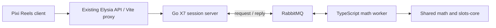

# X7 Club — playable specification and architecture

A neon capybara nightclub slot with original art and symbols. Konami's K-Pow! Pig Brilliant Buddha is a mechanics reference; X7 Club uses its own rules, paytable and implementation.

## Rules

- 5 reels × 3 rows, 20 left-to-right paylines. Stake = 20 × integer multiplier.
- CHILL / HYPE / LOL / GG / SEVEN pay for 3–5 matches. WILD substitutes; the first non-wild sets the combination. An all-wild prefix pays at the best configured paytable award. COIN does not pay on lines.
- Six or more COIN symbols enter Hold & Spin. Each locked coin carries its own integer credit award. Empty positions independently receive a coin with probability 85/1000 on a respin.
- Start with three respins. Any new coin resets the counter to three. A miss removes one. Three consecutive misses or a full board finish the feature after queued column boosters resolve.
- Filling a column queues its booster once. BANK (weight 65) ends it; +1× stake (24) and +2× stake (10) add credits to each of that column's three coins; ×7 (1) multiplies their current values and ends the booster. A maximum of seven pulls also banks the column. Boosters never consume respins.
- MINI / MAJOR / MEGA are fixed initial awards of 10× / 50× / 250× original stake. Their coin values can subsequently grow in the column booster. These are not progressive jackpots.
- Buy Bonus costs 77× original stake and places six CREDIT coins at positions 0, 2, 4, 6, 10, 14, each worth `buyEntryCredits × multiplier`. Purchased entries and organic triggers have different prize distributions.
- The bonus is paid once at completion. The whole-round cap, including preceding base line wins, is 7,777× original stake. Observed Monte Carlo maxima are not the theoretical cap.

The exact symbol weights, integer awards, paytable and booster probabilities live in [config.json](../packages/games/x7-club/config/config.json). Client labels, TypeScript math and generated Go costs read this source rather than maintaining separate cost settings.

## Shared components

| Responsibility                               | Implementation                                                                                                             |
| -------------------------------------------- | -------------------------------------------------------------------------------------------------------------------------- |
| RNG and weighted sampling                    | `@tgslots/math` module-level `Sampler` constants; raw RNG consumed only by machine `spin` / `next`                         |
| Line evaluation                              | `slots-core` payline trie, flat paytable, `evaluateSpin`, `ProjectedGrid`                                                  |
| Held prizes / respin counter / column boosts | Game-independent deterministic `slots-core/src/hold-spin/hold-spin.ts`; games supply sampled arrivals and boost operations |
| State, wager, metrics                        | Existing `StateMachine`, integer `Wager`, `BetConfiguration`, canonical payout and RTP metric kinds                        |
| Tests                                        | `SlotsTestEngine`, including shared-mechanic fixture tests and purchase-cost accounting                                    |
| Simulation                                   | Existing CLI, `runSimulation`, `runWorkerLoop`, `ModernDataCollector`, worker snapshots and HTML visualizer                |
| Discovery and promotion                      | Shared game registry / manifest / library and React marketing registry                                                     |
| Reels                                        | PixiJS 8 + `pixi-reels` 4.1 native Hold & Win board; additional one-cell booster reel                                      |

Only slot-specific symbols, sampled prize tiers, buy-entry layout, cap and presentation remain in `packages/games/x7-club` and the client game module. There is no separate simulation loop or alternative line evaluator.

The simulation CLI accepts optional `SIM_CONFIG.betConfigForMode`, allowing purchased rounds to use an actual 1,540-credit wager while keeping the original multiplier. The purchase-mode machine calls `buyBonus` on its spin entry point. This preserves shared collector normalization and does not change the normal game's HTTP wager semantics.

## Request path and authority



Go owns sessions, balance, paid costs, revisions and idempotency. The TypeScript worker is a pure seeded state transition: it receives a versioned command with prior state, seed, action and multiplier, then returns the next state and result. It never changes the wallet. The browser only animates authoritative outcomes.

RabbitMQ was selected for this request/reply workload. Each RPC uses correlation ID, exclusive reply queue and publisher confirms. Consumers confirm a reply before acknowledging the request. Kafka remains a possible later event-history transport; it is not needed for this demo's spin RPC. Reference: [RabbitMQ RPC tutorial](https://www.rabbitmq.com/tutorials/tutorial-six-javascript) and [publisher confirms](https://www.rabbitmq.com/docs/confirms).

Every mutation requires `sessionId`, unique `requestId`, `expectedRevision`, and payload. Go serializes each session. Its pending command retains the seed after a timeout; a new command cannot overtake it. A retry returns a cached result or replays the same seeded command, then debits/credits once. State reads resolve pending commands. Cache eviction cannot permit old charges because their revisions are stale.

Client pending request identity is saved before sending and survives reload. An ambiguous network/server failure exposes RETRY. Validated unexecuted 400 responses clear the pending command. Expired sessions and revision conflicts expose an explicit session reset.

The existing client orchestrator assumes local wallet accounting and a spin/free-spin lifecycle. X7 instead registers the typed `StandaloneGameClient` launch interface in the same manifest/library registry, preserving Go's wallet authority and its HOLD/BOOST action lifecycle. The native Pixi Reels counter is presentation state; the HUD always reads the server's respin counter. Native reel API: [Pixi Reels repository](https://github.com/schmooky/pixi-reels).

## Running and checking

Requires Bun 1.3.13, Go 1.26.4 and Docker. From this repository:

```bash
bun install --frozen-lockfile
bun run dev:x7
# library :3002, marketing :3004, existing API :3001, Go :3003
bun run x7:smoke
bun run validate
bun run x7:check
bun run build

# Standard simulations and existing visualizer:
bun run x7:sim --spins 1000000 --workers 2 --seed 777 --warmup 1000
bun run x7:sim --spins 1000000 --workers 2 --game-mode buy --warmup 1000
bun run x7:sim --spins 1000 --warmup 0 --visualize
bun scripts/x7-audit.ts

# Fully containerized backend instead of host Go/worker processes:
docker compose -p tgslots-x7 -f compose.x7.yml up -d --build
# host API, client and marketing can run through their usual dev scripts
```

Do not run host and container server/worker paths simultaneously against the same queue unless deliberately scaling compatible math workers. Development worker uses Bun watch; Go server needs restart after source changes.

Alternate instance ports are supported through `X7_AMQP_PORT`, `X7_MANAGEMENT_PORT`, `X7_HTTP_PORT`, `X7_API_PORT`, `X7_CLIENT_PORT`, `X7_MARKETING_PORT`, `X7_LISTEN_ADDR`, `RABBITMQ_URL`, `X7_SERVER_URL`, `X7_PROXY_URL`, `API_PROXY_URL` and `VITE_GAME_CLIENT_URL`. `X7_SMOKE_URL` selects the smoke-test public URL. For production bundles, the existing `VITE_API_URL` selects the public API; its X7 routes forward to Go using `X7_SERVER_URL`.

`bun run x7:check` also verifies that the audit SHA-256 matches the current math configuration.

The committed [math audit](../packages/games/x7-club/config/math-audit.json) records 5 million base rounds and 1 million purchases, actual costs, 95% Monte Carlo confidence intervals, worker seeds, shared metrics and the config SHA-256. The target is 96%, with a 1.5 percentage point simulation comparison tolerance. The reported estimate and its interval describe the sampled configuration, not an exact analytical RTP.

## Demo scope

Sessions match this platform's existing ephemeral design: one Go process, virtual credits, one-hour idle expiry, up to 5,000 sessions, 256 cached responses per session. Restart resets sessions. Durable queue delivery does not make the in-memory wallet persistent. Replicated Go servers require shared session/idempotency storage before adding load balancing. No real-money wallet or external deployment is configured.

## Art provenance and promotion

The nightclub background and capybara mascot were generated with the imagegen skill for X7 Club. Local source image: `01a11794-6b57-7fd2-8b4b-018ba79c9fdb/exec-216ac26b-398d-4f08-9ded-7fcb7e9d2f36.png`. The same generated artwork is delivered in the client and marketing assets. Symbol textures and three promotional feature icons are repository-native Pixi graphics / SVG. The marketing registry contains a complete X7 game page and launch link.

Mechanical reference: [Konami K-Pow! Pig Brilliant Buddha](https://www.konamigaming.com/games/all-games/details/k-pow%21-pig-brilliant-buddha-kgi).
